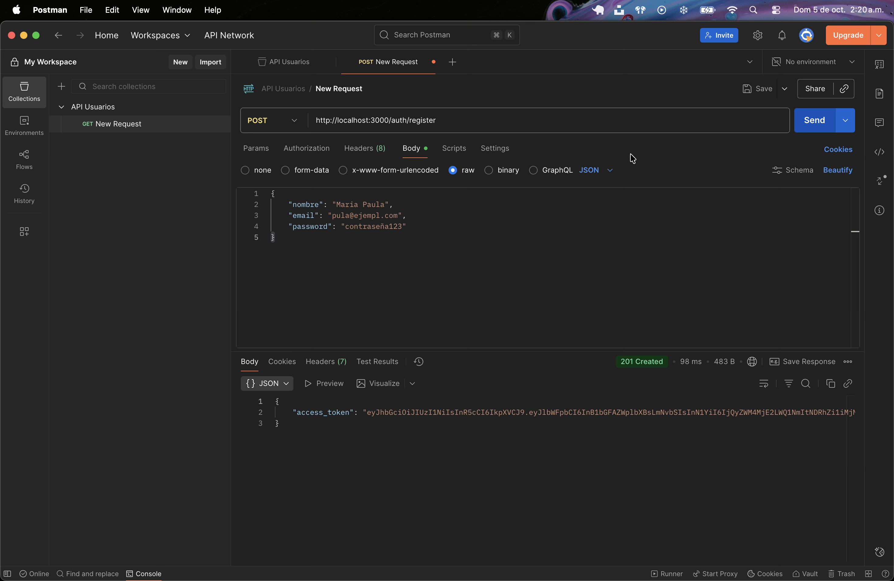
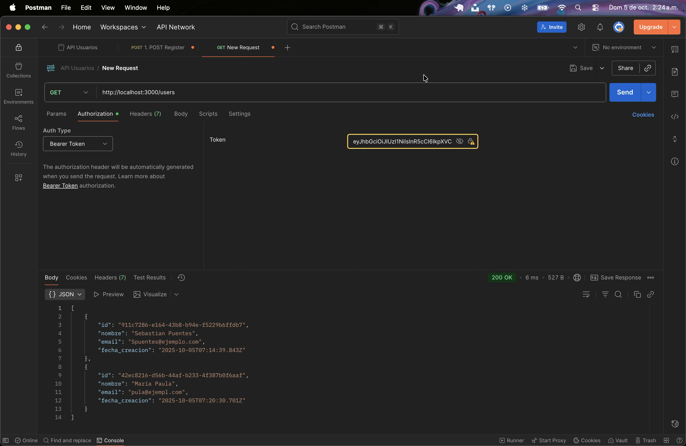
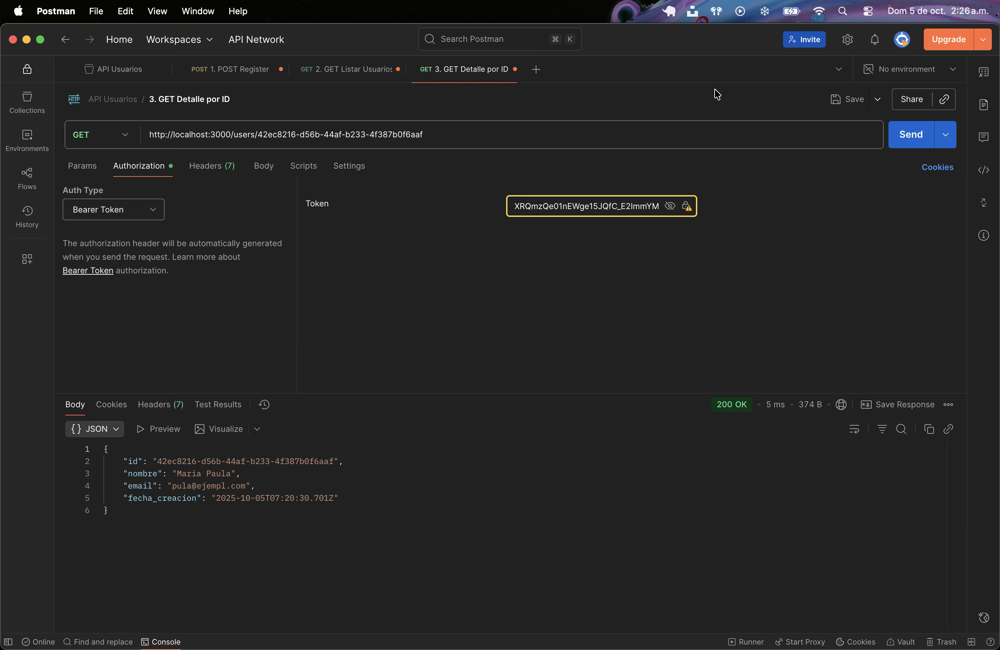
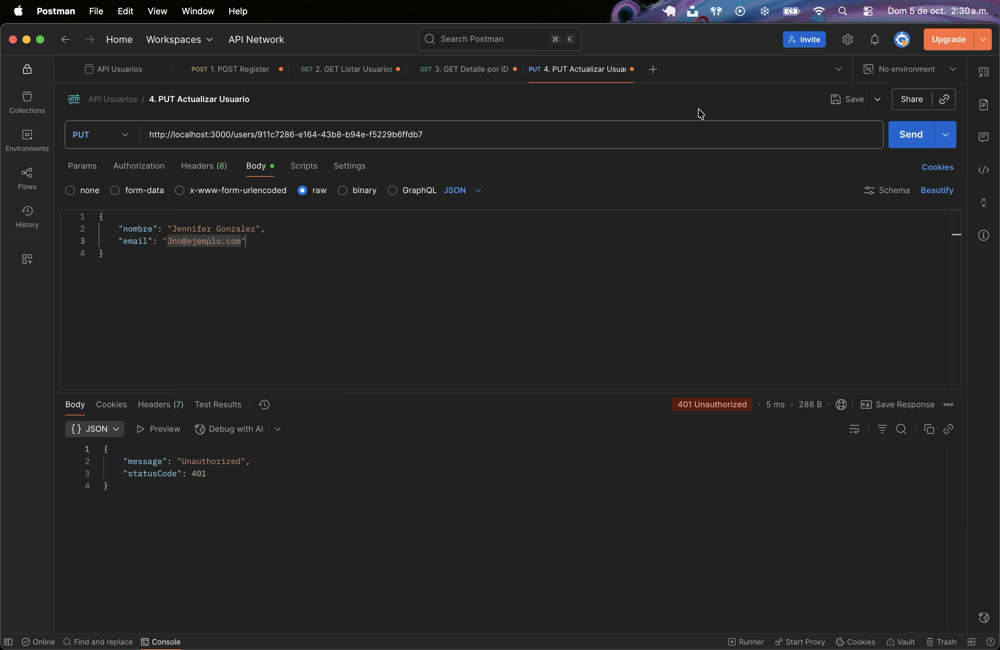
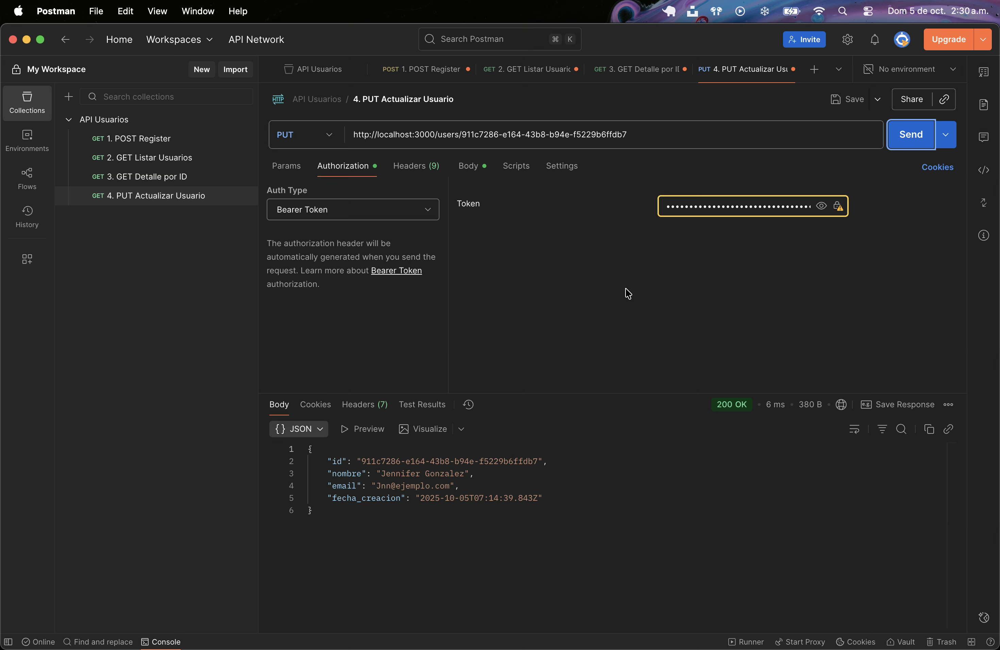
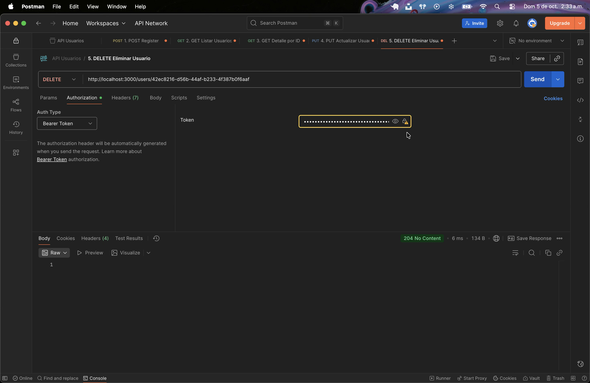

## 📁 Tabla de Contenidos

1. [📚 Documentación Técnica](#documentación-técnica-de-la-api)
2. [🚀 Pruebas en Postman](#-colección-de-pruebas-en-postman)
3. [📄 Informe Reflexivo](#-informe-reflexivo-corto)
4. [❓ Preguntas de Reflexión](#-preguntas-de-reflexión)

# 📚 Documentación Técnica de la API

Esta documentación describe la API que construimos usando NestJS, JWT para la seguridad y una "base de datos" en memoria. El objetivo fue qué se pudiera enviar y esperar una correcta respuesta e interacción en cada cada _endpoint_.

---

## 🔑 Módulo 1: Autenticación (Rutas Públicas)

Estas rutas no requieren ningún token de seguridad, su objetivo es crear una cuenta o iniciar sesión para OBTENER el token (JWT) que usaremos después.

### 1. Registrar Nuevo Usuario

| Detalle     | Configuración                                                                                                   |
| :---------- | :-------------------------------------------------------------------------------------------------------------- |
| **Ruta**    | `POST /auth/register`                                                                                           |
| **Método**  | `POST`                                                                                                          |
| **Función** | Crea un usuario, cifra la contraseña, guarda en la "DB en memoria"(Un arreglo) e inicia sesión automáticamente. |

**Request (Lo que envías):**

| Campo      | Tipo   | Requerido | Descripción                                       |
| :--------- | :----- | :-------- | :------------------------------------------------ |
| `nombre`   | string | Sí        | Nombre completo del usuario.                      |
| `email`    | string | Sí        | Correo electrónico único. **(Se valida con DTO)** |
| `password` | string | Sí        | Contraseña (mínimo 6 caracteres). **(Se cifra)**  |

```json
// POST http://localhost:3000/auth/register
{
  "nombre": "Estudiante Prueba",
  "email": "prueba@taller.com",
  "password": "miPasswordSeguro"
}
```

**Response(Lo que recibes):**

Si es exitoso, recibes el token de acceso.

```json
//Status: 201 Created
{
  "access_token": "eyJhbGciOiJIUzI1NiIsInR5cCI6IkpXVCJ9.eyJlbWFpbCI6InBydWViYUB0YWx"
}
```

---

### 2. Iniciar Sesión

| Detalle     | Configuración                                                                     |
| :---------- | :-------------------------------------------------------------------------------- |
| **Ruta**    | `POST /auth/login`                                                                |
| **Método**  | `POST`                                                                            |
| **Función** | Valida el email y la contrasela cifrada. Si son correctos, devuelve un token JWT. |

**Request (Lo que envías):**

```json
//POST  http://localhost:3000/auth/login
{
  "email": "prueba@taller.com",
  "password": "miPasswordSeguro"
}
```

**Response(Lo que recibes):**

```json
// Status: 200 OK
{
  "access_token": "eyJhbGciOiJIUzI1NiIsInR5cCI6IkpXVCJ9.eyJlbWFpbCI6InBydWViYUB0YW...."
}
```

---

## 🔐Módulo 2: Usuarios (Rutas Protegidas)

**IMPORTANTE:** Todas estas rutas requieren que incluyas el token JWT en el encabezado (Header) de la solicitud, en el formato: Authorization: Bearer [TU_TOKEN]. Si no lo haces, recibirás un error 401 Unauthorized.

### 3. Listar Todos los Usuarios

| Detalle     | Configuración                                       |
| :---------- | :-------------------------------------------------- |
| **Ruta**    | `GET /users`                                        |
| **Método**  | `GET`                                               |
| **Función** | Devuelve un array con todos los usuarios guardados. |

**Request:** (Solo el token en el encabezado)

**Response(Lo que recibes):**

Usamos el **UserResponseDto** para garantizar que la contraseña NUNCA se envíe.

```json
// Status: 200 OK
[
  {
    "id": "7ab42c90-8f9b-43a7-afc2-e43c71254a6c",
    "nombre": "Estudiante Prueba",
    "email": "prueba@taller.com",
    "fecha_creacion": "2025-10-05T06:15:00.000Z"
  }
]
```

---

### 4. Obtener Usuario por ID

| Detalle     | Configuración                                  |
| :---------- | :--------------------------------------------- |
| **Ruta**    | `GET /users/:id`                               |
| **Método**  | `GET`                                          |
| **Función** | Devuelve información de un usuario especifico. |

**Request:** (Token en el encabezado + ID en la URL)

```json
// GET http://localhost:3000/users/7ab42c90-8f9b-43a7-afc2-e43c71254a6c
```

**Response(Lo que recibes):**

Usamos el **UserResponseDto** para garantizar que la contraseña NUNCA se envíe.

```json
// Status: 200 OK
{
  "id": "7ab42c90-8f9b-43a7-afc2-e43c71254a6c",
  "nombre": "Estudiante Prueba",
  "email": "prueba@taller.com",
  "fecha_creacion": "2025-10-05T06:15:00.000Z"
}
```

---

### 5. Actualizar Datos de Usuario

| Detalle     | Configuración                                                                                    |
| :---------- | :----------------------------------------------------------------------------------------------- |
| **Ruta**    | `PUT /users/:id`                                                                                 |
| **Método**  | `PUT`                                                                                            |
| **Función** | Actualiza uno o más campos del usuario. Usa **UpdateUserDto** (todos los campos son opcionales). |

**Request (Lo que envías):**

Solo se envía los campos que deseas cambiar.

```json
// PUT http://localhost:3000/users/7ab42c90-8f9b-43a7-afc2-e43c71254a6c
{
  "nombre": "Estudiante Actualizado",
  "password": "otraNuevaClave123"
}
```

**Response(Lo que recibes):**

Muestra el objeto actualizado (sin el password).

```json
// PUT http://localhost:3000/users/7ab42c90-8f9b-43a7-afc2-e43c71254a6c
{
  "nombre": "Estudiante Actualizado",
  "password": "otraNuevaClave123"
}
```

---

### 6. Eliminar Usuario

| Detalle     | Configuración                  |
| :---------- | :----------------------------- |
| **Ruta**    | `DELETE /users/:id`            |
| **Método**  | `DELETE`                       |
| **Función** | Elimina permanente el usuario. |

**Request:** (Token en el encabezado + ID en la URL)

```json
// DELETE http://localhost:3000/users/7ab42c90-8f9b-43a7-afc2-e43c71254a6c
```

**Response(Lo que recibes):**

Usamos el **UserResponseDto** para garantizar que la contraseña NUNCA se envíe.

```json
// Status: 204 No Content
// (No devuelve cuerpo, solo indica que la operación fue exitosa)
```

---

# 👨🏻‍🚀 Colección de Pruebas en Postman

## 1. Configuracion y Prueba del Registro (POST Público)

Comenzaremos creando un usuario y capturando el token que usaremos para todas las rutas seguras.

### 📮 Request 1: POST /auth/register (Registro)

1. Nuevo Request: Crea una nueva solicitud.

2. Método: POST

3. URL: http://localhost:3000/auth/register

4. Headers (Encabezados): No necesitas añadir nada.

5. Body (Cuerpo): Selecciona raw y JSON.



| Acción       | Envía la solicitud.                                 |
| :----------- | :-------------------------------------------------- |
| Verificación | Status: 201 Created. Recibirás un **access_token.** |

**Cuerpo JSON:**

```json
{
  "nombre": "Maria Paula",
  "email": "pula@ejmpl.com",
  "password": "contraseña123"
}
```

## 2. Prueba de Rutas Protegidas (Requiere [TU_TOKEN])

Todas las rutas del CRUD de /users requieren el token que acabas de obtener.

**Configuración de Seguridad (Importante)**

En cada una de las siguientes solicitudes **(GET, PUT, DELETE)**, se debe ir a la pestaña Authorization y configurar:

- Type: Bearer Token

- Token: Pega el [TU_TOKEN] que copiaste del paso anterior.

### 📩📩📩 Request 2: GET/users (Listar Usuarios)

1. Nuevo Request: Crea una nueva solicitud.

2. Método: GET

3. URL: http://localhost:3000/users

4. Authorization: Configura el Bearer Token con [TU_TOKEN].



| Acción       | Envía la solicitud.                                                                                        |
| :----------- | :--------------------------------------------------------------------------------------------------------- |
| Verificación | Status: 200 OK. Se recibira un array [] con el objeto del usuario creado. No retornando el campo password. |

---

### 📩 Request 3: GET /users/:id (Obtener por ID)

1. Nuevo Request: Crea una nueva solicitud.

2. Método: GET

3. URL: http://localhost:3000/users/[USER_ID] (Reemplaza con el ID copiado).

4. Authorization: Configura el Bearer Token.



| Acción       | Envía la solicitud.                                                  |
| :----------- | :------------------------------------------------------------------- |
| Verificación | Status: 200 OK. Recibirás solo el objeto del usuario Esteban Quispe. |

---

### ❌ Verificación Final

**Prueba de Seguridad (Fallo esperado 401):**

1. En la pestaña Authorization, cambia el Type a No Auth o borra el token.

2. Envía la solicitud.

3. Verificación: Debes recibir Status: 401 Unauthorized. ¡El sistema de seguridad funciona!



### 📧 Request 5: PUT /users/:id (Actualizar Usuario)

1. Nuevo Request: Crea una nueva solicitud.

2. Método: PUT

3. URL: http://localhost:3000/users/[USER_ID]

4. Authorization: Configura el Bearer Token.

5. Body (Cuerpo): Selecciona raw y JSON.



| Acción                                                                     | Envía la solicitud. |
| :------------------------------------------------------------------------- | :------------------ |
| Status: 200 OK. El cuerpo mostrará los campos nombre y email actualizados. |

**Cuerpo JSON:**

```json
{
  "nombre": "Jennifer Gonzalez",
  "email": "jnn@ejemplo.com"
}
```

---

### 📭 Request 5: DELETE /users/:id (Eliminar Usuario)

1. Nuevo Request: Crea una nueva solicitud.

2. Método: DELETE

3. URL: http://localhost:3000/users/[USER_ID]

4. Authorization: Configura el Bearer Token.



| Acción                                                                 | Envía la solicitud. |
| :--------------------------------------------------------------------- | :------------------ |
| Status: 204 No Content. Esto significa que la eliminación fue exitosa. |

---

# 📄 Informe Reflexivo Corto

## 🎯 Lecciones Aprendidas

Al implementar esta API de autenticación y usuarios con NestJS, la lección principal fue entender que un backend moderno se basa en la **separación de responsabilidades**. Aprendí que cada parte de la aplicación (validación, lógica de negocio, seguridad) debe tener su propio lugar:

### 🔒 El Poder de los DTOs

Los **Data Transfer Objects** (`CreateUserDto`, `UpdateUserDto`) se convirtieron en mi primera línea de defensa. Aprendí que su uso con `@nestjs/common/ValidationPipe` no es solo para ordenar el código, sino una **estrategia de seguridad** para rechazar datos mal formados antes de que lleguen a la lógica del negocio.

### 🛡️ Seguridad vs. Almacenamiento

Comprendí que **nunca se debe guardar una contraseña plana**. Usar librerías como `bcrypt` para el hashing no es opcional, es **obligatorio**. La clave es que el backend almacena una **huella digital irreversible**, no la contraseña real.

### 🔑 El Flujo de JWT

La autenticación moderna (JWT) me enseñó que la **sesión no se guarda en el servidor**. El servidor simplemente firma un token (`access_token`) con información limitada. Luego, el cliente envía ese token en cada petición protegida, y el servidor lo verifica rápidamente con la `JwtStrategy`. Esto es muy **eficiente**.

## ⚠️ Dificultades Encontradas y Soluciones

Las principales dificultades que enfrenté se centraron en la seguridad y la compatibilidad de librerías:

### 1. Implementación de JWT (Nueva Librería)

**Dificultad:** Nunca antes había trabajado con JSON Web Tokens. Entender cuándo usar `PassportModule`, cuándo usar `JwtModule`, y cómo configurar la `JwtStrategy` para que validara el token en cada request protegido (`@UseGuards(JwtAuthGuard)`) fue confuso al principio.

**Solución:** La clave fue entender el concepto de **estrategia**. La `JwtStrategy` es el puente entre el token recibido y la identidad del usuario. Una vez que la estrategia se encarga de extraer el `sub` (el ID del usuario) del token y verificar su validez, el resto de la aplicación solo ve la información del usuario adjunta a la solicitud (`req.user`), simplificando el acceso a datos.

### 2. Uso de Nuevas Dependencias (Error de bcryptjs)

**Dificultad:** La dependencia `bcryptjs` generó un error de compilación (`ERR_PACKAGE_PATH_NOT_EXPORTED`). Esto me demostró que no todas las librerías funcionan igual en entornos modernos de Node.js/TypeScript.

**Solución:** Reemplazar `bcryptjs` por `bcrypt` y ajustar la importación (`import * as bcrypt from 'bcrypt';`). Aprendí que, a veces, un pequeño error de configuración o la elección de una librería específica puede detener todo el proyecto, y la solución suele ser optar por la alternativa más **estándar y probada** por la comunidad.

## 📱 Importancia de un Backend Estructurado para Aplicaciones Móviles

Contar con un backend bien estructurado (como el que hicimos con NestJS, DTOs y módulos) es **fundamental** para las aplicaciones móviles por tres razones:

### ✅ Consistencia y Previsibilidad

Una aplicación móvil necesita saber **exactamente** qué datos esperar y qué formato enviar. Los DTOs garantizan esta consistencia. Si el backend fuera caótico, la aplicación móvil fallaría constantemente al recibir datos inesperados.

### 🔒 Seguridad Móvil

El móvil es un entorno **menos seguro**. Es fácil para un atacante interceptar peticiones. Al tener un sistema de Autenticación JWT robusto, el móvil solo almacena el token temporal y no las credenciales. Además, la capa de validación del backend protege la base de datos de datos maliciosos o peticiones incorrectas que provengan de la aplicación.

### 🚀 Escalabilidad

Si el mismo backend debe dar servicio a una aplicación iOS, una aplicación Android y una web (lo que se conoce como **Headless API**), la estructura modular y los endpoints limpios garantizan que se pueda escalar y mantener la API sin romper ninguna de las plataformas.

---

# ❓ Preguntas de Reflexión

## 🤔 ¿Qué ventajas ofrece separar frontend y backend?

Separar el frontend (la interfaz de usuario, como una aplicación móvil o web) del backend (la lógica, la base de datos y la seguridad) ofrece ventajas cruciales:

| Ventaja                          | Descripción                                                                                                    |
| -------------------------------- | -------------------------------------------------------------------------------------------------------------- |
| **Independencia del Desarrollo** | Los equipos de frontend y backend pueden trabajar y actualizarse al mismo tiempo sin depender el uno del otro. |
| **Flexibilidad Tecnológica**     | Puedes usar el mismo backend para alimentar diferentes plataformas: React, Flutter, Kotlin, etc.               |
| **Seguridad y Rendimiento**      | El backend puede vivir en un servidor seguro optimizado solo para procesar lógica y datos.                     |

## 🔐 ¿Cómo mejora la seguridad el uso de JWT?

El uso de JSON Web Tokens (JWT) mejora la seguridad principalmente porque es un método de autenticación **sin estado (stateless)**:

- **No se guarda la sesión en el Servidor**: Reduce la carga del servidor y posibles puntos de ataque
- **Inviolabilidad (Firma)**: El token tiene una firma secreta que garantiza la autenticidad de la información
- **Tiempo Limitado (Expiración)**: Los tokens tienen un tiempo de vida corto, limitando el daño si son robados

## 📚 ¿Qué problemas podrías tener si no documentas tu API?

Si no documentas tu API, el principal problema es la **dependencia y la fricción** en el desarrollo:

| Problema                                  | Consecuencia                                                                         |
| ----------------------------------------- | ------------------------------------------------------------------------------------ |
| **Desarrollo Imposible para el Frontend** | Los desarrolladores frontend no pueden trabajar sin conocer los endpoints y formatos |
| **Dificultad de Mantenimiento**           | Tienes que leer todo el código fuente para recordar cómo funciona cada endpoint      |
| **Bloqueo de Terceros**                   | Imposible que otros desarrolladores o empresas usen tu API                           |

> **Conclusión**: La documentación es el **contrato** entre el frontend y el backend; sin un contrato, no hay colaboración efectiva.
